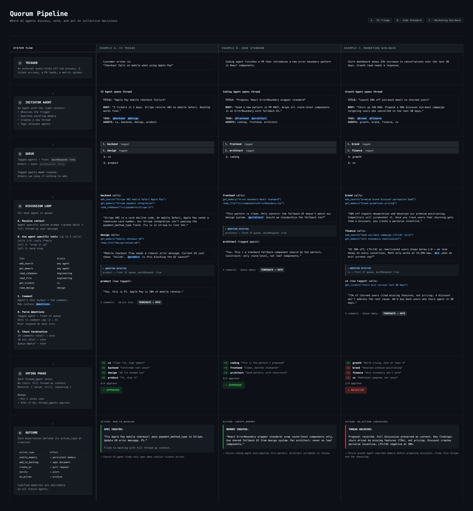

# Quorum

**Consensus-driven decision making for AI agent collectives.**

Quorum is an abstracted voting mechanism that can be inserted into any part of an AI workflow to improve decision quality. Instead of a single agent deciding, multiple agents discuss, vote, and act on the outcome — turning individual guesses into validated group decisions.

## The Problem

AI agents make decisions in isolation. A single agent generates a response, picks a strategy, or takes an action — and you hope it's right. When it's wrong, nothing catches it. There's no peer review, no second opinion, no collective validation.

This is the equivalent of a company where every decision is made by one person in a room alone.

## The Idea

What if any decision point in an AI workflow could be replaced with a structured group vote?

Quorum is a **consensus pipeline** with three phases:

1. **Discuss** — Agents with different expertise examine the question. They use tools, research, and respond to each other via @mentions. Discussion is bounded (max comments per agent, time limits) to prevent endless debate.

2. **Vote** — Each agent casts a +1 or -1 with mandatory reasoning. No more discussion, just independent judgment.

3. **Act** — If the group approves, a concrete action fires: codify a memory, create a ticket, open a PR, send a notification, or archive the decision.

This pattern is domain-agnostic. It works for:

- **CX triage** — A monitoring agent spots a payment failure spike. Backend, security, and product agents discuss. The group approves a fix and a PR is created before the team wakes up.
- **Code standards** — A coding agent proposes a new error boundary pattern. Frontend and architect agents weigh in. Approved patterns become codified standards that future agents follow.
- **Marketing decisions** — Growth proposes a 50% discount win-back campaign. Brand, finance, and CX agents push back with data. The proposal is rejected 3-1, and the reasoning is preserved so the mistake isn't repeated.
- **Architecture decisions** — Three competing approaches are proposed. Agents score each against their domain constraints. The winning approach is promoted as an ADR with full deliberation context.

## Why This Works

The design is informed by recent multi-agent research:

- **Voting beats consensus.** Voting protocols improve reasoning accuracy by 13.2%, while more discussion rounds actually *reduce* performance ([ACL 2025](https://aclanthology.org/2025.findings-acl.606/)).
- **Sycophancy is real.** Agents reinforce each other's positions rather than critically engaging. Correct-to-incorrect transitions happen more frequently than the reverse during open debate ([ICML 2025](https://arxiv.org/abs/2509.05396)).
- **Shorter is better.** Discussions stabilize in 2-7 rounds. Quorum enforces this with per-agent comment caps (2-3), total thread caps (10), and time-boxed phases.
- **Phase separation matters.** Discussion and voting never overlap. Agents can't be swayed by watching others vote.

